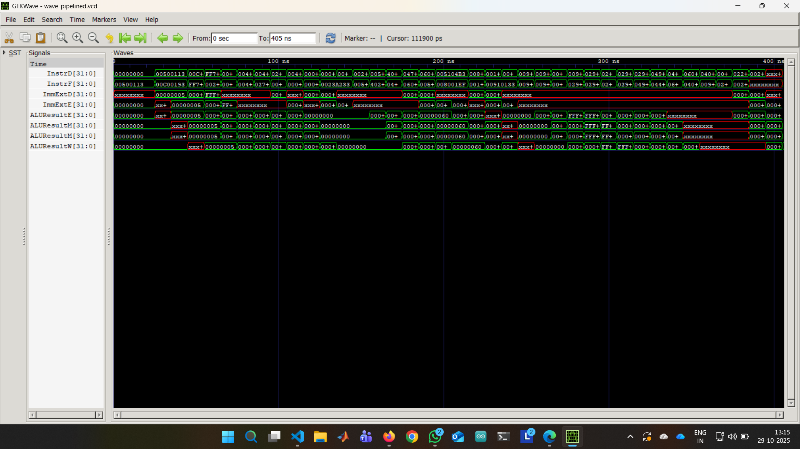

# 🧠 RISC-V 5-Stage Pipelined Processor

This repository contains the SystemVerilog implementation of a **RISC-V 5-stage pipelined processor**, built as part of an academic **course project** at **IIT Guwahati**.  
The design follows the standard RISC-V RV32I instruction set and demonstrates core processor design concepts such as **pipelining, hazard detection, and forwarding**.

---

## 📁 Directory Structure

.
├── docs/ # Documentation and architecture diagrams
│ ├── Control_Hazard.png
│ ├── Forwarding_Hazard.png
│ ├── Load_Hazard.png
│ ├── pipeline_overview.png
│ └── REPORT.md

├── src/ # Source code of processor modules
│ ├── controller.sv
│ ├── datapath.sv
│ ├── forwarding_unit.sv
│ ├── hazard_unit.sv
│ ├── Remaining_Modules.sv
│ └── riscvpipeline.sv

├── tb/ # Testbench and verification files
│ ├── tb_pipeline.sv
│ ├── 25InAddr100.png
│ ├── Successful_Running.png
│ └── Memory_Image.png

├── tests/ # Test program or instruction memory data
│ └── rvx10_pipeline.txt

└── README.md


---

## 🏗️ Architecture Overview

The processor implements the **5 classic pipeline stages**:

| Stage | Name | Function |
|--------|------|-----------|
| IF | Instruction Fetch | Fetches instruction from memory using Program Counter (PC). |
| ID | Instruction Decode | Decodes instruction and reads operands from register file. |
| EX | Execute | Performs arithmetic/logic operations and computes addresses. |
| MEM | Memory Access | Accesses data memory for load/store instructions. |
| WB | Write Back | Writes results back to the register file. |

The following diagrams illustrate the internal structure and hazard-handling mechanisms:

<p align="center">
  <br>
  <em>Overall Pipelined Processor Architecture</em>
</p>

<p align="center">
  
  <br>
  <em>Forwarding and Control Hazard Mechanisms</em>
</p>

---

## ⚙️ Modules Description

| File | Module | Description |
|------|---------|-------------|
| `controller.sv` | Controller | Decodes RISC-V instructions and generates control signals. |
| `datapath.sv` | Datapath | Core pipeline stages and interconnections. |
| `forwarding_unit.sv` | Forwarding Unit | Resolves data hazards by forwarding results. |
| `hazard_unit.sv` | Hazard Unit | Detects load-use and control hazards; inserts stalls. |
| `Remaining_Modules.sv` | Utility Modules | ALU, Register File, Multiplexers, Memory, etc. |
| `riscvpipeline.sv` | Top-Level | Integrates all modules into a single processor entity. |

---

## 🧪 Simulation & Verification

The design was verified using a **SystemVerilog testbench** (`tb/tb_pipeline.sv`) with custom instruction sequences stored in  
`tests/rvx10_pipeline.txt`.

### Tools Used
- **Icarus Verilog** — for simulation  
- **GTKWave** — for waveform visualization  

### Run Instructions

```bash
# Navigate to the root directory
cd RISC-V-Pipeline/

# 1. Compile all source and testbench files
iverilog -o riscv_pipeline_tb \
src/*.sv tb/tb_pipeline.sv

# 2. Run the simulation
vvp riscv_pipeline_tb

# 3. View waveforms
gtkwave dump.vcd


The tb_pipeline.sv testbench initializes instruction and data memories, applies clock and reset,
and generates dump.vcd for waveform viewing.

🧮 Features Implemented

✅ 5-Stage Pipelined Execution (IF → ID → EX → MEM → WB)
✅ Data Forwarding & Hazard Detection
✅ Load-Use and Branch Stall Handling
✅ Modular Design for Debugging & Testing
✅ Fully Verified via Simulation


📊 Example Outputs

Example waveform and memory snapshots can be found in /tb:

25InAddr100.png — Address-space verification snapshot

Memory_Image.png — Memory state visualization post-execution


📚 Documentation

A detailed report describing the pipeline structure, control signal flow, and hazard-handling logic
is available in docs/REPORT.md .

👨‍💻 Author

Ch. Sriram Satvik
B.Tech, Electronics and Electrical Engineering
Indian Institute of Technology, Guwahati

🧾 License

This project is intended for educational and research purposes.